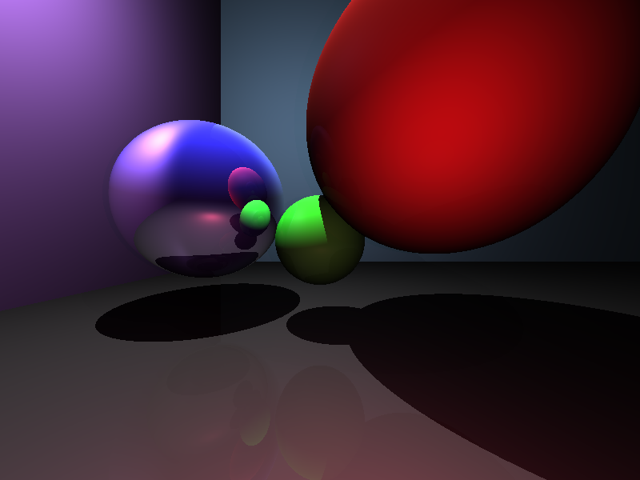
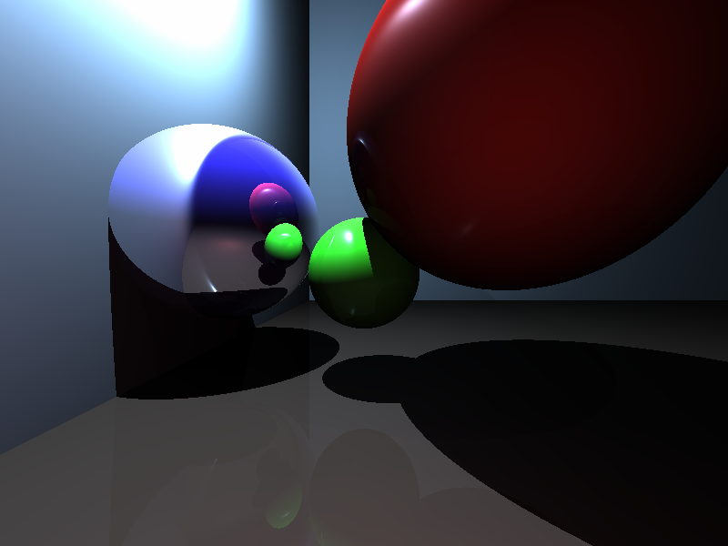

# Rayzor
👁️ My ICS4U ISP, a ray-tracing experiment.


## What is this?

Last year, as part of the final project of ICS3U, I made a very simple [raycaster](https://en.wikipedia.org/wiki/Ray_casting), as it was something I had newly learned about. This year, I'm stepping into the next dimension with a full 3D [raytracer](https://en.wikipedia.org/wiki/Ray_tracing_(graphics)), built from scratch (and a little [vector math library](https://github.com/Ewpratten/libvec) to go with it). This project was inspired by @bheisler's "[Raytracing in Rust](https://bheisler.github.io/post/writing-raytracer-in-rust-part-1/)" project, and was developed with help from [Scratchapixel](https://www.scratchapixel.com/) and an assignment from [Joel Ross](https://faculty.washington.edu/joelross/)' [CS 315](https://faculty.washington.edu/joelross/courses/archive/f13/cs315/hwk/6/) course at the University of Puget Sound.

## Examples

Here are a few examples of scenes rendered by this software:


<br>
*An enclosed room with 3 light sources, and 3 balls*

<br><br>


<br>
*Same scene, with a closer wall, and a single white light*

## Render times

This software does CPU rendering (I have yet to learn anything about GPU rendering). Running on an Intel i3-8130U running at 2.20GHz, Im getting the following render times for the first example scene:

| Resolution | Max reflections | Time                 |
| ---------- | --------------- | -------------------- |
| 800x600    | 10              | 3 seconds            |
| 800x600    | 1000            | 15 seconds           |
| 1920x1080  | 100             | 20 seconds           |
| 3840x2160  | 100             | 32 seconds           |
| 15360x8640 | 1000000         | 7 minutes 28 seconds |


As you can see, not the world's best render times, but pretty good for my first try, with absolutely no 3D graphics experience of any kind.

## Using the main program

The main program can be run with:

```sh
./graldew :run
```

This will ray-trace a pre-defined scene (stored in `src/main/java/ca/retrylife/ics4u/rayzor/scenes/Balls.java`), and output the render to `output.png`

## Using the "RT" viewer
This project has a second, experimental frontend that can be found at `ca.retrylife.ics4u.rayzor.RTApp`. It uses @salamander2's [hsa2](https://github.com/salamander2/HSA2) graphics library to display a simple ray-traced "world". It runs at about 0.004 FPS on my computer, and movement is slow because of it.

Here are the keybindings for the program:

| Key | Action               |
| --- | -------------------- |
| W   | Move camera forward  |
| S   | Move camera backward |
| A   | Move camera left     |
| D   | Move camera right    |
| Q   | Move camera down     |
| E   | Move camera up       |